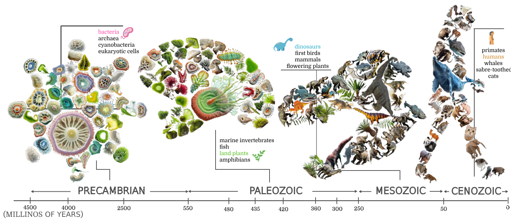

# Shape Cloud Collage on Irregular Canvas

Sheng-Yi Yao, Dong-Yi Wu, Thi-Ngoc-Hanh Le, Tong-Yee Lee

This paper addresses a challenging and novel problem in 2D shape cloud visualization: arranging irregular 2D shapes on an irregular canvas to minimize gaps and overlaps while emphasizing critical shapes by displaying them in larger sizes. The concept of a shape cloud is inspired by word clouds, which are widely used in visualization research to aesthetically summarize textual datasets by highlighting significant words with larger font sizes. We extend this concept to images, introducing shape clouds as a powerful and expressive visualization tool, guided by the principle that a picture is worth a thousand words. Despite the potential of this approach, solutions in this domain remain largely unexplored. To bridge this gap, we develop a 2D shape cloud collage framework that compactly arranges 2D shapes, emphasizing important objects with larger sizes, analogous to the principles of word clouds. This task presents unique challenges, as existing 2D shape layout methods are not designed for scalable irregular packing. Applying these methods often results in suboptimal layouts, such as excessive empty spaces or inaccurate representations of the underlying data. To overcome these limitations, we propose a novel layout framework that leverages recent advances in differentiable optimization. Specifically, we formulate the irregular packing problem as an optimization task, modeling the object arrangement process as a differentiable pipeline. This approach enables fast and accurate end-to-end optimization, producing high-quality layouts. Experimental results show that our system efficiently creates visually appealing and high-quality shape clouds on arbitrary canvas shapes, outperforming existing methods.

## Code

We will release code after this paper is accepted in the future.
